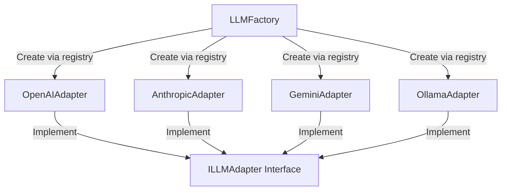

# Báo Cáo Hoàn Thành — Phase 2: LLM Adapter System

Tài liệu này tổng hợp chi tiết kết quả thiết kế, cấu trúc lớp chuyển đổi mô hình ngôn ngữ lớn (LLM Adapters) và cơ chế xử lý lỗi bền vững (**Phase 2: LLM Adapter System**) cho PetBot AI Chatbot.

---

## 🔌 1. Kiến Trúc LLM Adapter & Registry Pattern
Để bảo vệ dự án khỏi sự phụ thuộc vào một nhà cung cấp AI duy nhất (Vendor Lock-in), hệ thống triển khai theo mô hình **Adapter Pattern**:

- **`ILLMAdapter`**: Giao diện chung định nghĩa các phương thức nghiệp vụ bắt buộc như `chat` (sinh hội thoại) và `embed` (chuyển đổi văn bản thành vector).
- **`LLMFactory`**: Lớp quản lý tập trung sử dụng **Registry Pattern** để tự động đăng ký và khởi tạo phiên bản Adapter cụ thể dựa trên chuỗi định cấu hình trong hệ thống (`llm_provider`).

---

## 🛠️ 2. Triển Khai Các LLM Adapters
Hệ thống hỗ trợ song song 4 mô hình lớn đáp ứng linh hoạt các kịch bản chạy Production hay kiểm thử Development:
1. **`OpenAIAdapter`**: Kết nối với API của OpenAI (mặc định là `gpt-4o-mini`), cung cấp cả chức năng hội thoại và tạo vector nhúng (embedding).
2. **`AnthropicAdapter`**: Kết nối với dòng mô hình Claude của Anthropic (mặc định là `claude-haiku-4-5`) phục vụ kịch bản lập luận phức tạp hoặc làm mô hình dự phòng (fallback).
3. **`GeminiAdapter`**: Tích hợp dòng mô hình thế hệ mới của Google (`gemini-1.5-flash`) thông qua SDK chính thức `langchain-google-genai`.
4. **`OllamaAdapter`**: Kết nối với mô hình chạy offline tại local vật lý của nhà phát triển (như `llama3`, `mistral`) phục vụ phát triển ứng dụng không tốn phí hoặc kiểm thử offline.

---

## 🛡️ 3. Cơ Chế Xử Lý Lỗi Bền Vững (Fault-Tolerance)
Nhằm đảm bảo hệ thống vận hành liên tục ngay cả khi API nhà cung cấp gặp sự cố tạm thời hoặc bị quá tải (rate limit), hệ thống đã tích hợp:
- **Tenacity Retry Logic**: Cấu hình cơ chế tự động thử lại cuộc gọi LLM tối đa **3 lần** kết hợp với thuật toán **Exponential Backoff** (giãn cách thời gian tăng dần giữa các lần thử lại).
- **Fallback Provider (Mô hình dự phòng)**: Trong trường hợp mô hình chính (ví dụ: OpenAI) bị sập hoàn toàn, hệ thống tự động phát hiện ngoại lệ và chuyển hướng cuộc gọi sang mô hình dự phòng đã cấu hình sẵn (ví dụ: Anthropic hoặc Gemini) để đảm bảo không ngắt quãng trải nghiệm người dùng.

---

## 📊 4. Chuẩn Hóa Kết Quả Đầu Ra (`LLMResponse`)
- Toàn bộ kết quả trả về từ các nhà cung cấp LLM khác nhau được đồng nhất hóa thành cấu trúc dữ liệu phẳng `LLMResponse`.
- `LLMResponse` chứa đựng thông tin chuẩn hóa:
  - `text`: Nội dung câu trả lời dạng chuỗi văn bản.
  - `tokens_used`: Tổng lượng token tiêu thụ trong lượt chat.
  - `model`: Tên dòng mô hình thực tế đã xử lý truy vấn.
  - `tool_calls`: Danh sách thông tin cuộc gọi công cụ (nếu LLM yêu cầu gọi tool).
