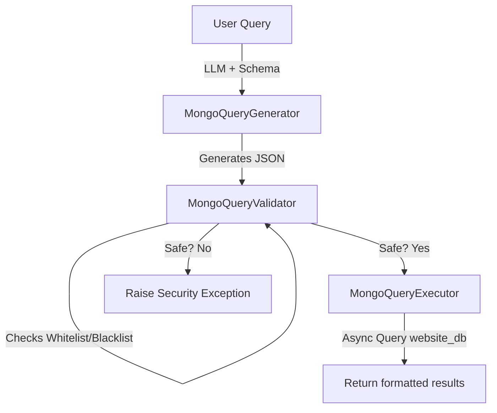

# Báo Cáo Hoàn Thành — Phase 3: Tools Implementation

Tài liệu này tổng hợp chi tiết kết quả thiết kế, cài đặt các công cụ nghiệp vụ ngoại vi (Tools) và các cơ chế bảo mật cơ sở dữ liệu (**Phase 3: Tools Implementation**) cho PetBot AI Chatbot.

---

## 🔍 1. Các Công Cụ Tra Cứu Tri Thức Ngoại Vi
Hệ thống trang bị 3 nhóm công cụ chính giúp Agent tiếp cận và thu thập tri thức chính xác để trả lời câu hỏi:
1. **`TavilyWebSearchTool`**: Kết nối với Tavily API để thực hiện tìm kiếm trực tiếp trên môi trường internet, thu thập thông tin mới nhất và định dạng kết quả rút gọn tối ưu cho LLM prompt.
2. **`QdrantVectorSearchTool`**: Nhận vector nhúng từ câu hỏi, thực hiện tìm kiếm tương đồng ngữ nghĩa trên Qdrant Vector DB trong collection `pet_knowledge_base` để trích xuất các cẩm nang sức khỏe và dinh dưỡng thú cưng.

---

## 🛡️ 2. Bộ Công Cụ MongoDB Trực Quan & Bảo Mật Tuyệt Đối
Để cho phép Agent có khả năng tra cứu trạng thái đơn hàng hoặc thông tin dịch vụ trên cơ sở dữ liệu website chính thông qua ngôn ngữ tự nhiên mà vẫn đảm bảo an toàn tuyệt đối cho cơ sở dữ liệu hệ thống, chúng tôi đã phát triển bộ công cụ chuyên dụng:

* **`MongoDBSchemaContext`**: Tự động kết nối và trích xuất cấu trúc dữ liệu (Schema) của các collection được phép tra cứu để làm ngữ cảnh đầu vào cho Agent, đảm bảo Agent hiểu chính xác các trường dữ liệu thực tế.
* **`MongoQueryGenerator`**: Sử dụng khả năng lập luận của LLM để chuyển dịch yêu cầu tiếng Việt của người dùng thành cấu trúc truy vấn JSON MongoDB chính xác (bao gồm `filter` và `projection`).
* **`MongoQueryValidator` (Gia cố bảo mật tối thượng)**:
  - **Whitelist Collections**: Chỉ cho phép thực hiện truy vấn trên các collection cấu hình sẵn (`products`, `pets`, `orders`, `services`).
  - **Inject JWT user_id**: Khi truy vấn lịch sử mua hàng hoặc đơn hàng trong collection `orders`, hệ thống tự động chèn cứng `user_id` trích xuất từ JWT token xác thực của người dùng hiện tại, hoàn toàn không tin tưởng vào bộ lọc do LLM tự sinh ra nhằm triệt tiêu lỗi phân quyền ngang.
  - **Operator Blacklist**: Chặn đứng tất cả các toán tử cập nhật, xóa hoặc ghi dữ liệu nguy hiểm như `$write`, `$out`, `$merge`, `$rename` để loại bỏ nguy cơ bị tấn công chèn lệnh (Injection).
  - **Limit Guard**: Cưỡng ép chèn giới hạn bản ghi (`limit`) tối đa là 50 kết quả trả về cho mỗi truy vấn để tránh hiện tượng nghẽn mạng hoặc tràn bộ nhớ.
* **`MongoQueryExecutor`**: Thực thi bất đồng bộ câu lệnh an toàn đã qua kiểm duyệt lên Website DB bằng driver `motor` và định dạng kết quả dưới dạng chuỗi văn bản sạch sẽ.

---

## 🗃️ 3. Quản Lý Tập Trung Với `ToolRegistry`
- Lớp `ToolRegistry` chịu trách nhiệm tập hợp toàn bộ các thực thể tool và cung cấp cổng truy xuất duy nhất theo tên định danh (`web_search`, `vector_search`, `mongo_query`).
- Giúp tách biệt hoàn toàn việc cấu hình khởi tạo các kết nối database phức tạp khỏi tầng điều phối Agent lõi.
