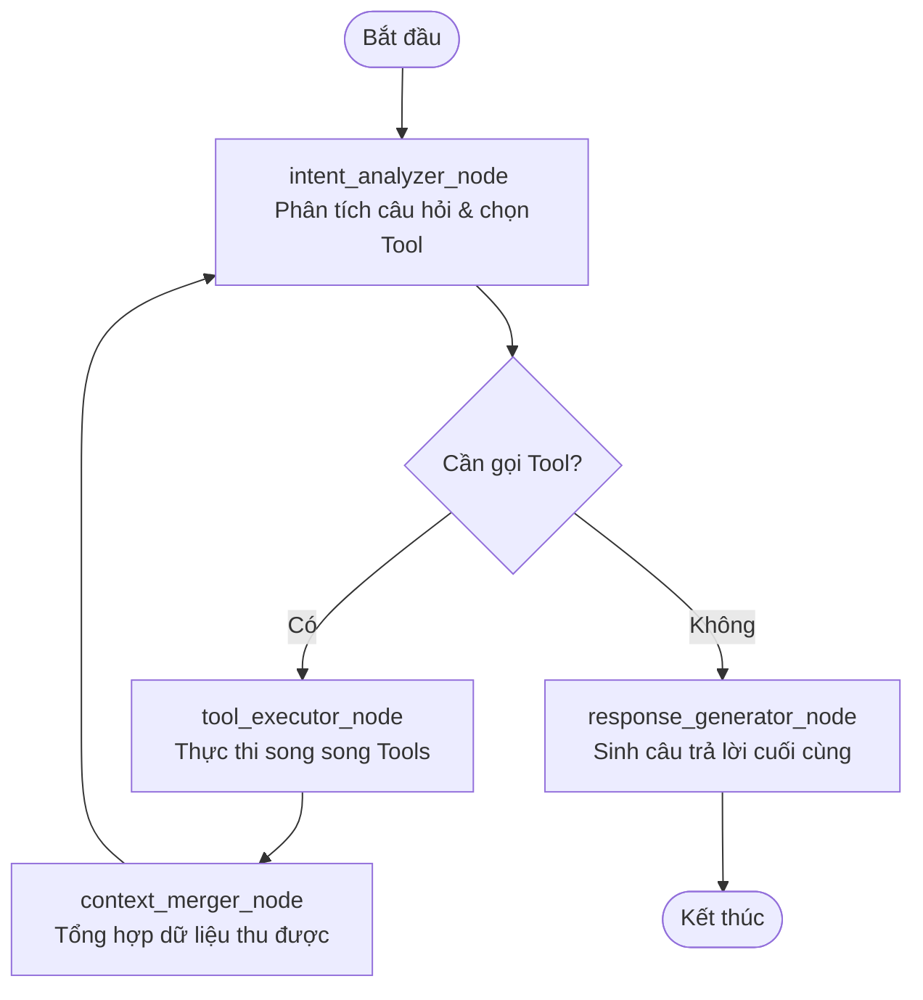

# Báo Cáo Hoàn Thành — Phase 4: Agent Orchestrator

Tài liệu này tổng hợp chi tiết kết quả thiết kế, đồ thị lập luận đa bước (Multi-step Reasoning) và cơ chế vận hành Agent lõi bằng LangGraph (**Phase 4: Agent Orchestrator**) cho PetBot AI Chatbot.

---

## 🧭 1. Thiết Kế Trạng Thái Hội Thoại (`AgentState`)
Để kiểm soát toàn bộ luồng suy nghĩ của Agent qua nhiều chu kỳ gọi công cụ phức tạp, hệ thống định nghĩa cấu trúc dữ liệu `AgentState` kế thừa từ `TypedDict` chứa các tham số quan trọng:
- `query`: Câu hỏi thô ban đầu của người dùng.
- `user_id`: Định danh người dùng hiện tại (nếu đã đăng nhập).
- `is_authenticated`: Cờ đánh dấu người dùng ẩn danh (Guest) hay thành viên (Member).
- `history`: Lịch sử các tin nhắn hội thoại trước đó làm ngữ cảnh lập luận.
- `summary`: Nội dung tóm tắt hội thoại bằng AI (nếu có) để làm giàu ngữ cảnh.
- `tools_to_execute`: Danh sách các tools cần gọi được LLM phân tích ở chu kỳ hiện tại.
- `tool_results`: Kết quả thực thi thực tế của các tools.
- `final_response`: Nội dung câu trả lời cuối cùng được sinh ra cho người dùng.

---

## 🕸️ 2. Bản Đồ Đồ Thị Lập Luận LangGraph (`StateGraph`)
Agent được xây dựng như một đồ thị tuần hoàn trạng thái (StateGraph) giúp mô phỏng chính xác chu trình suy nghĩ - hành động - phản hồi của con người:

- **`intent_analyzer_node`**: Sử dụng LLM kết hợp với kỹ thuật Few-shot Prompting để đọc câu hỏi, lịch sử và xác định xem có cần gọi công cụ tra cứu tri thức nào không. Nếu có, trả về cấu trúc JSON chứa danh sách công cụ và tham số tương ứng.
- **`tool_executor_node`**: Tự động dispatch các công cụ nghiệp vụ trong `ToolRegistry`. Các công cụ không phụ thuộc dữ liệu của nhau sẽ được kích hoạt **chạy song song hoàn toàn** thông qua `asyncio.gather` giúp tối ưu hóa đáng kể thời gian xử lý phản hồi (đảm bảo P95 < 5 giây).
- **`context_merger_node`**: Định dạng sạch sẽ kết quả trả về từ tất cả các tools và nhúng vào trạng thái hội thoại hiện tại dưới dạng ngữ cảnh tri thức đã được xác thực (Grounding Context).
- **`response_generator_node`**: Sử dụng mô hình LLM để kết hợp câu hỏi ban đầu, lịch sử hội thoại và ngữ cảnh tri thức đã xác thực ở bước trước để sinh ra một câu trả lời chính xác, khách quan bằng tiếng Việt có dấu.

---

## 🛡️ 3. Cơ Chế Kiểm Soát Lặp Vô Hạn (Iteration Guard)
- Một trong những nhược điểm lớn của Agent tuần hoàn là khả năng LLM bị kẹt vào vòng lặp vô hạn (gọi đi gọi lại một công cụ khi kết quả không đổi).
- Để giải quyết triệt để vấn đề này, chúng tôi đã tích hợp cơ chế kiểm soát chặn cứng `MAX_TOOL_ITERATIONS = 5`. Nếu Agent thực hiện quá 5 chu kỳ gọi công cụ liên tiếp mà không sinh ra câu trả lời cuối cùng, hệ thống tự động ngắt kết nối đồ thị và kích hoạt sinh câu trả lời bằng tri thức sẵn có của mô hình để bảo vệ tài nguyên hệ thống.
