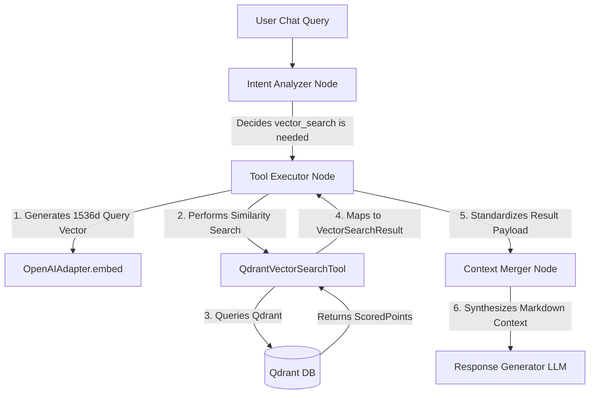

# Qdrant Vector Database Integration & Ingestion Pipeline Specification

This document provides a comprehensive analysis of the existing Qdrant vector database implementation in the **PNetAI Chatbot** codebase. It outlines the exact query structure, payload requirements, and architectural recommendations for building a production-grade ingestion pipeline for JSON (FAQ blogs) and PDF (dog/cat disease reference manuals) documents.

---

## 1. Technical Specifications of the Vector Database

The current integration is optimized for **1536-dimensional embeddings** with **Cosine Similarity** metrics. These dimensions align perfectly with OpenAI's `text-embedding-ada-002` (default) and `text-embedding-3-small` models.

### Key DB Settings & Configurations
*   **Default Host & Port:** `localhost:6333` (configured via `settings.qdrant_host` and `settings.qdrant_port`).
*   **Collection Name:** `pet_knowledge_base` (configured via `settings.qdrant_collection`).
*   **Vector Configuration:**
    *   **Dimension Size (`VECTOR_DIM`):** `1536`
    *   **Distance Metric (`DISTANCE_METRIC`):** `COSINE` (defined in `client.py` as `models.Distance.COSINE`)

---

## 2. Core Source Code Components & Query Flow

To ensure the new ingestion pipeline perfectly matches the chatbot's query flow, we must inspect the following three core application layers:



### A. Lifecycle & Collection Setup: `client.py`
Located at: `src/pnetai_chatbot/infrastructure/persistence/qdrant/client.py`

*   **Lazy Connection:** The client connection `AsyncQdrantClient` is initialized lazily through a property `client` when needed.
*   **Auto-Provisioning:** `ensure_collection_exists` verifies if the target collection is present in Qdrant. If missing, it creates it dynamically with:
    ```python
    await self.client.create_collection(
        collection_name=self._collection,
        vectors_config=models.VectorParams(
            size=VECTOR_DIM,       # 1536
            distance=DISTANCE_METRIC, # COSINE
        ),
    )
    ```

### B. Query & Retrieval Adapter: `vector_search_tool.py`
Located at: `src/pnetai_chatbot/infrastructure/tools/vector_search_tool.py`

*   Implements `IVectorStore` which defines:
    ```python
    async def similarity_search(
        self,
        query_embedding: list[float],
        top_k: int = 5,
        filters: dict[str, Any] | None = None,
    ) -> list[VectorSearchResult]:
    ```
*   **Search Method:** Uses `self._client.search(...)` with `with_payload=True` to retrieve documents along with their associated metadata.
*   **Mapping logic:**
    ```python
    VectorSearchResult(
        id=str(r.id),
        content=r.payload.get("content", "") if r.payload else "",
        score=float(r.score),
        metadata=dict(r.payload) if r.payload else None,
    )
    ```
    > [!IMPORTANT]
    > **Mapping Rule:** The query adapter expects a `"content"` field at the root level of the Qdrant payload. Any other fields embedded in the payload are forwarded intact in the `metadata` dictionary.

### C. Agent Execution Node: `tool_executor.py`
Located at: `src/pnetai_chatbot/infrastructure/agent/nodes/tool_executor.py`

*   When the chatbot router selects the `vector_search` tool:
    1.  It retrieves the raw query string: `query = params_hint.get("query", "")`.
    2.  It embeds the query text using the LLM client: `embedding = await self._llm.embed(query)`.
    3.  It calls similarity search: `results = await tool_inst.similarity_search(query_embedding=embedding, top_k=5)`.
    4.  It constructs an standardized dictionary of matching entries to send to the merger.

### D. Context Aggregation Layer: `context_merger.py`
Located at: `src/pnetai_chatbot/infrastructure/agent/nodes/context_merger.py`

*   The results are processed and formatted into markdown to inject into the system prompt context:
    ```python
    meta = doc.get("metadata") or {}
    title = meta.get("title", f"Document {idx}")
    content = doc.get("content", "").strip()
    score = doc.get("score", 0)
    part += f"**{idx}. {title}** (Relevance: {score:.2f})\n"
    part += f"   *Snippet*: {content}\n\n"
    ```
    > [!IMPORTANT]
    > **Key Payload Requirements:**
    > 1. `content`: Stored directly under the payload root. Contains the main text snippet.
    > 2. `title`: Stored in the payload. Read by `context_merger.py` via `metadata.get("title")`.

---

## 3. Mandatory Payload Schema for Data Ingestion

To ensure that your newly ingested data is correctly queried, matched, and displayed to the LLM without raising errors, **all points uploaded to the collection MUST conform to this exact payload schema**:

| Field Name | Type | Required | Description | Example / Best Practice |
| :--- | :--- | :--- | :--- | :--- |
| **`title`** | `str` | **Yes** | The title of the article, blog post, FAQ, or PDF section name. Used directly by `context_merger.py` to header the reference. | `"Điều trị bệnh giun tim ở chó"` |
| **`content`** | `str` | **Yes** | The core text snippet (chunk) to be matched and outputted in the prompt context. | `"Giun tim di truyền qua muỗi... Các triệu chứng bao gồm..."` |
| **`category`** | `str` | **Yes** | Standard metadata categorizing the topic. Useful for semantic filters. | Choose from: `["nutrition", "healthcare", "care", "grooming", "behavior"]` |
| **`species`** | `str` | **Yes** | The type of pet this content applies to. | Choose from: `["dog", "cat", "all"]` |
| **`tags`** | `list[str]` | **Yes** | Specific keywords related to the medical condition, topic, or FAQ. | `["giun tim", "ký sinh trùng", "sức khỏe chó"]` |
| **`source`** | `str` | No (Recommended) | Traceability reference to the original JSON file name or PDF file name. | `"benh-cho-meo-cam-nang.pdf"` |
| **`page`** | `int` | No (Recommended) | The source page number (relevant for PDF extractions). | `14` |

---

## 4. Ingestion Pipeline Architecture & Folder Structure

We highly recommend maintaining a modular codebase for ingestion. Place your new ingestion logic in a dedicated folder in the root directory (e.g., `scripts/ingest/` or a customized folder):

```
PNetAI_Chatbot/
├── scripts/
│   ├── seed_vector_db.py         # Original sample seeder (reference)
│   └── ingest/                   # <--- NEW Ingestion Folder
│       ├── __init__.py
│       ├── parser.py             # Parses PDF pages & JSON files
│       ├── splitter.py           # Text splitting & chunking rules
│       └── pipeline.py           # Main runner script (read files -> embed -> upsert)
```

### Recommended Processing Flow
1.  **Read and Parse:**
    *   **JSON:** Read list of blog FAQs. Map each FAQ entry containing Q&A pairs directly into unified text blocks (e.g., `"Hỏi: {question}\nĐáp: {answer}"`).
    *   **PDF:** Read document pages using a robust library such as `pypdf` or `pdfplumber`. Extract textual lines cleanly.
2.  **Split and Chunk:**
    *   Since LLM prompt context is limited and search accuracy is higher on compact texts, split longer PDF chapters into chunks of **800–1000 characters** with an overlap of **100–150 characters** (using `langchain`'s `RecursiveCharacterTextSplitter`, which is already in your `pyproject.toml`).
3.  **Embed in Batches:**
    *   Call `openai` client to generate 1536-dimensional embeddings. Do this in batches (e.g., 20 chunks per batch) to respect rate limits and maximize processing speed.
4.  **Upsert Deterministically:**
    *   Generate a deterministic `UUIDv5` for each point using a unique identifier string (e.g., `f"{source_filename}_page_{page}_chunk_{idx}"`).
    *   **Why?** This prevents duplicate entries in the database. Running the pipeline multiple times will safely overwrite/update existing entries in Qdrant rather than appending duplicates.

---

## 5. Ingestion Pipeline Blueprint (Production-Grade)

Below is a complete, production-grade Python script template designed for your pipeline. It uses the project's native configurations, the official `AsyncQdrantClient`, and `langchain` splitting utilities.

You can save this script as `scripts/ingest/pipeline.py` and run it instantly.

```python
#!/usr/bin/env python3
"""Unified Data Ingestion Pipeline for Qdrant.

Supports:
- JSON FAQ documents (Blog Q&A)
- PDF Reference Manuals (Dog & Cat Diseases)

Prerequisites:
    pip install pypdf
Usage:
    uv run python scripts/ingest/pipeline.py --data-dir ./data
"""

import argparse
import asyncio
import json
import logging
import os
import uuid
from pathlib import Path
from typing import Any, Generator

from dotenv import load_dotenv
from openai import AsyncOpenAI
from qdrant_client import AsyncQdrantClient
from qdrant_client.http import models as qdrant_models
from langchain_text_splitters import RecursiveCharacterTextSplitter
from pypdf import PdfReader

# Load settings from root .env
load_dotenv()

logging.basicConfig(
    level=logging.INFO,
    format="%(asctime)s [%(levelname)s] %(message)s",
)
logger = logging.getLogger(__name__)

# Constants matching active Qdrant setup
VECTOR_DIM = 1536
BATCH_SIZE = 16


class IngestionPipeline:
    """Handles parsing, chunking, embedding, and upserting data to Qdrant."""

    def __init__(self, data_dir: Path, collection_name: str):
        self.data_dir = data_dir
        self.collection_name = collection_name
        self.qdrant_client = AsyncQdrantClient(
            host=os.getenv("QDRANT_HOST", "localhost"),
            port=int(os.getenv("QDRANT_PORT", "6333")),
        )
        self.openai_client = AsyncOpenAI(api_key=os.getenv("OPENAI_API_KEY", ""))
        self.splitter = RecursiveCharacterTextSplitter(
            chunk_size=900,
            chunk_overlap=120,
            length_function=len,
            separators=["\n\n", "\n", ". ", " ", ""],
        )

    async def initialize_collection(self) -> None:
        """Create Qdrant collection if not already existing."""
        collections = await self.qdrant_client.get_collections()
        names = [c.name for c in collections.collections]

        if self.collection_name not in names:
            await self.qdrant_client.create_collection(
                collection_name=self.collection_name,
                vectors_config=qdrant_models.VectorParams(
                    size=VECTOR_DIM,
                    distance=qdrant_models.Distance.COSINE,
                ),
            )
            logger.info("Created new collection: '%s'", self.collection_name)
        else:
            logger.info("Target collection '%s' is ready.", self.collection_name)

    def parse_json_faq(self, file_path: Path) -> list[dict[str, Any]]:
        """Parse structured FAQ/Blog JSON files.
        
        Expected JSON format:
        [
            {
                "id": "faq-01",
                "question": "Mèo nhà tôi bỏ ăn phải làm sao?",
                "answer": "Khi mèo bỏ ăn trên 24h, cần kiểm tra...",
                "category": "healthcare",
                "species": "cat",
                "tags": ["mèo bỏ ăn", "chăm sóc mèo"]
            }
        ]
        """
        logger.info("Parsing JSON FAQ file: %s", file_path.name)
        processed_docs = []
        with open(file_path, "r", encoding="utf-8") as f:
            data = json.load(f)
            
        for item in data:
            question = item.get("question", "")
            answer = item.get("answer", "")
            
            # Combine question and answer for vector search content matching
            combined_content = f"Hỏi: {question}\nĐáp: {answer}"
            
            processed_docs.append({
                "id_base": item.get("id") or str(uuid.uuid4()),
                "title": f"FAQ: {question[:60]}...",
                "content": combined_content,
                "category": item.get("category", "healthcare"),
                "species": item.get("species", "all"),
                "tags": item.get("tags", []),
                "source": file_path.name,
                "page": 1
            })
        return processed_docs

    def parse_pdf_disease_manual(self, file_path: Path) -> list[dict[str, Any]]:
        """Parse PDF medical/disease documents page by page and chunks text."""
        logger.info("Parsing PDF manual: %s", file_path.name)
        processed_chunks = []
        
        reader = PdfReader(file_path)
        
        # Metadata values (infer from file name or directory if needed)
        species = "dog" if "cho" in file_path.name.lower() else "cat" if "meo" in file_path.name.lower() else "all"
        
        for page_idx, page in enumerate(reader.pages, 1):
            text = page.extract_text()
            if not text or not text.strip():
                continue
                
            # Chunk the extracted page text
            chunks = self.splitter.split_text(text)
            
            for chunk_idx, chunk_content in enumerate(chunks):
                # We can formulate a semantic title based on the filename and page number
                title = f"Cẩm nang Bệnh: {file_path.stem.replace('_', ' ').title()} (Trang {page_idx})"
                
                processed_chunks.append({
                    "id_base": f"{file_path.stem}-p{page_idx}-c{chunk_idx}",
                    "title": title,
                    "content": chunk_content,
                    "category": "healthcare",
                    "species": species,
                    "tags": ["bệnh chó mèo", "cẩm nang điều trị", file_path.stem],
                    "source": file_path.name,
                    "page": page_idx
                })
        return processed_chunks

    async def get_embeddings(self, texts: list[str]) -> list[list[float]]:
        """Generate vector embeddings using OpenAI embeddings model."""
        response = await self.openai_client.embeddings.create(
            input=texts,
            model="text-embedding-ada-002"
        )
        # Sort values based on index to ensure direct mapping matches
        sorted_data = sorted(response.data, key=lambda x: x.index)
        return [item.embedding for item in sorted_data]

    async def process_batch(self, batch: list[dict[str, Any]]) -> None:
        """Embed and upsert a batch of documents/chunks into Qdrant."""
        texts_to_embed = [f"{doc['title']}\n{doc['content']}" for doc in batch]
        embeddings = await self.get_embeddings(texts_to_embed)
        
        points = []
        for doc, embedding in zip(batch, embeddings):
            # Generate a stable UUIDv5 from the ID base to ensure idempotency
            point_id = str(uuid.uuid5(uuid.NAMESPACE_DNS, doc["id_base"]))
            
            points.append(
                qdrant_models.PointStruct(
                    id=point_id,
                    vector=embedding,
                    payload={
                        "title": doc["title"],
                        "content": doc["content"],
                        "category": doc["category"],
                        "species": doc["species"],
                        "tags": doc["tags"],
                        "source": doc["source"],
                        "page": doc["page"],
                    }
                )
            )
            
        await self.qdrant_client.upsert(
            collection_name=self.collection_name,
            points=points,
        )

    async def run(self) -> None:
        """Main execution flow scanning for all target data formats."""
        if not os.getenv("OPENAI_API_KEY"):
            logger.error("Missing OPENAI_API_KEY. Ingestion cancelled.")
            return

        await self.initialize_collection()
        
        all_docs = []
        
        # 1. Scan and parse files
        for ext in ["*.json", "*.pdf"]:
            for file_path in self.data_dir.rglob(ext):
                if file_path.suffix == ".json":
                    all_docs.extend(self.parse_json_faq(file_path))
                elif file_path.suffix == ".pdf":
                    all_docs.extend(self.parse_pdf_disease_manual(file_path))
                    
        total_docs = len(all_docs)
        logger.info("Found %d total text chunks prepared for ingestion.", total_docs)
        
        # 2. Batch process embeddings and ingestion
        for i in range(0, total_docs, BATCH_SIZE):
            batch = all_docs[i : i + BATCH_SIZE]
            try:
                await self.process_batch(batch)
                logger.info(
                    "Successfully ingested batch %d/%d (%d points uploaded)",
                    (i // BATCH_SIZE) + 1,
                    (total_docs + BATCH_SIZE - 1) // BATCH_SIZE,
                    len(batch)
                )
            except Exception as e:
                logger.error("Failed to ingest batch starting at index %d: %s", i, e)

        # Close clients
        await self.qdrant_client.close()
        await self.openai_client.close()
        logger.info("Pipeline Execution Completed!")


def main():
    parser = argparse.ArgumentParser(description="PNetAI Qdrant Ingestion Pipeline")
    parser.add_argument(
        "--data-dir",
        type=str,
        default="./data",
        help="Directory containing the target PDF and JSON files."
    )
    args = parser.parse_args()
    
    data_path = Path(args.data_dir)
    if not data_path.exists():
        logger.error("Data directory does not exist: %s", data_path.absolute())
        return

    collection = os.getenv("QDRANT_COLLECTION", "pet_knowledge_base")
    pipeline = IngestionPipeline(data_dir=data_path, collection_name=collection)
    
    # Run pipeline asynchronously
    asyncio.run(pipeline.run())


if __name__ == "__main__":
    main()
```

---

## 6. How to Deploy and Run Your Pipeline

Once you have written your pipeline module (e.g. inside `scripts/ingest/`):

1.  **Install Required PDF Library:**
    Ensure `pypdf` is added to your environment to enable parsing of your medical PDFs:
    ```bash
    uv add pypdf
    ```
2.  **Create your local Data Folder:**
    Put your target files in an organized structure:
    ```bash
    mkdir -p data/
    # Place your blog_faqs.json and benh_cho_meo.pdf inside the data/ folder
    ```
3.  **Run the Ingestion Pipeline:**
    Execute the pipeline using the local Virtual Environment:
    ```bash
    uv run python scripts/ingest/pipeline.py --data-dir ./data
    ```

---
*This specification and baseline code are prepared as a concrete blueprint. You can copy the code directly to get started on your customized ingestion workflow.*
